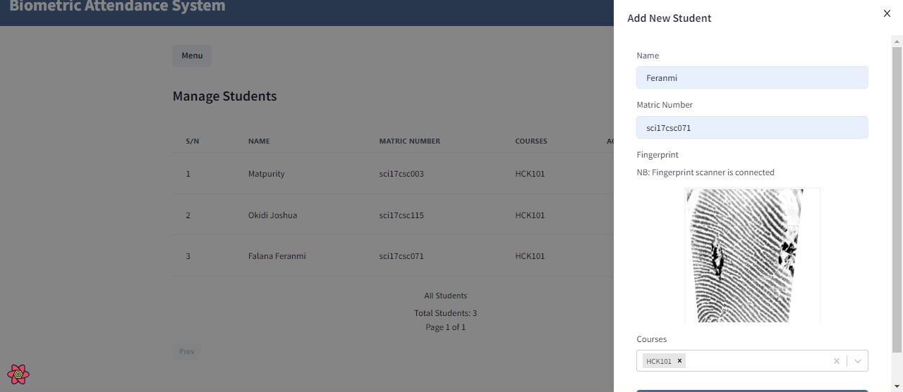

# Biometric Attendance System

This biometric attendance system is a time and attendance tracking system that allows staff or teachers to organize courses, manage students, and mark students' attendance using their unique physical characteristics—their fingerprints. It's built using computer vision (Python OpenCV), Flask, and the MERN stack.

NB: This system has been built and tested with The DigitalPersona U.are.U 4500 scanner only. It currently supports Windows OS.

Below is an image of the DigitalPersona U.are.U 4500 scanner:


Download and install the client for windows here: [HID DigitalPersona Client](https://drive.google.com/file/d/12QCh311WQ-_PIkMHeXqNRfTkbIWnnSdY/view?usp=sharing)

## Project Structure

The project is divided into three sections:


## Getting Started

Follow the steps below to set up the project locally

1.  Clone repo:

  ```bash
  [HTTPS] - git clone https://github.com/Mikailhassan/school-attendnce-management-software.git
  [SSH] - git clone git@github.com:Mikailhassan/school-attendnce-management-software.git
  ```


## Project DB ERD


## Screenshots





If you have a suggestion for improvement, Send an email to mikailismail260@gmail.com. You can also open an issue with the tag "enhancement".


License
This project is licensed under the MIT License. See the LICENSE file for more information.


