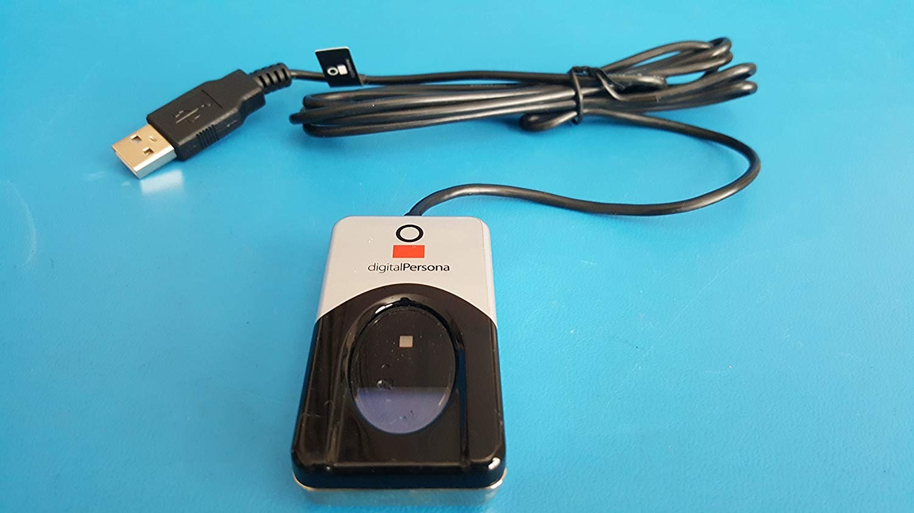
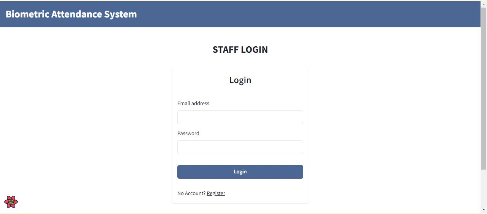
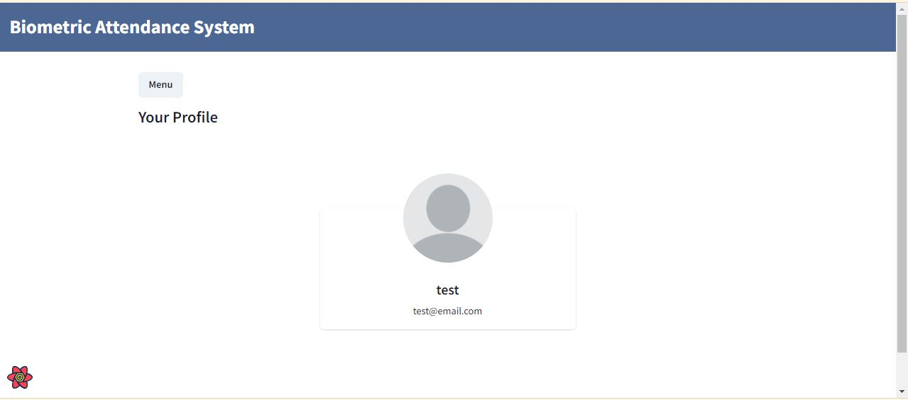
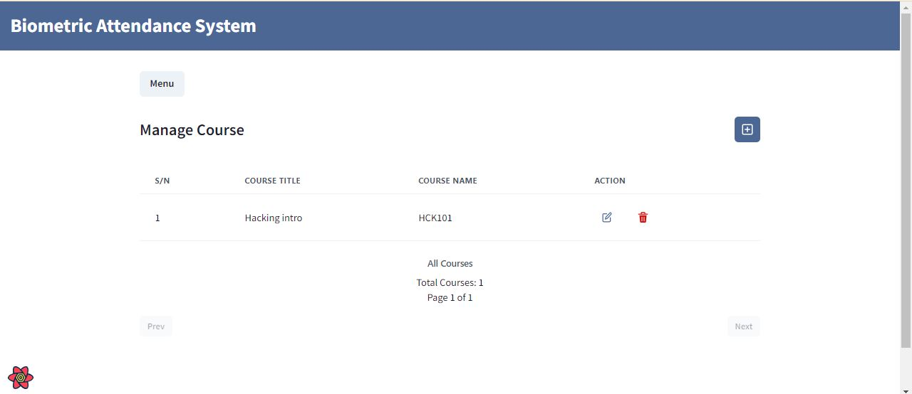
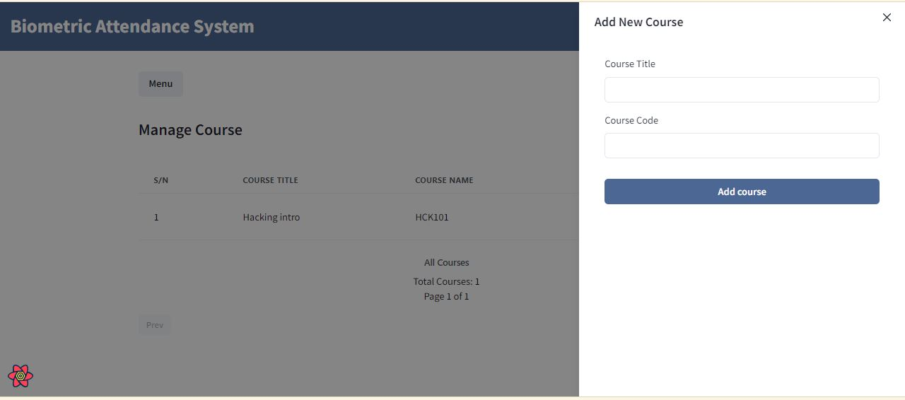
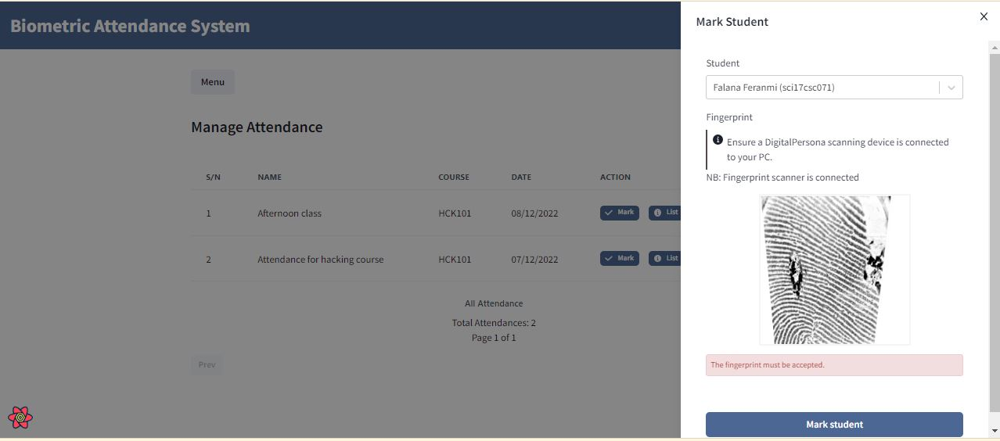
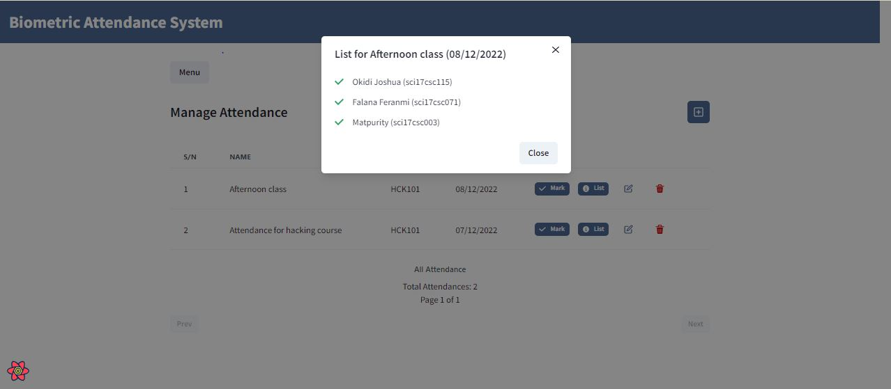

# Biometric Attendance System

This biometric attendance system is a time and attendance tracking system that allows staff or teachers to organize courses, manage students and mark students' attendance using their most unique physical characteristics—their fingerprints. It's built with computer vision (Python OpenCV), Flask and the MERN stack.

**NB**: This system has been built and tested with The DigitalPersona U.are.U 4500 scanner only. It only supports Windows OS for now.

Below is an image of a DigitalPersona U.are.U 4500 scanner


Download and install the client for windows here: [HID DigitalPersona Client](https://drive.google.com/file/d/12QCh311WQ-_PIkMHeXqNRfTkbIWnnSdY/view?usp=sharing)

## Project Structure

The project is divided into three sections:


## Getting Started

Follow the steps below to set up the project locally

1.  Clone repo:

  ```bash
  [HTTPS] - git clone https://github.com/Mikailhassan/school-attendnce-management-software.git
  [SSH] - git clone git@github.com:Mikailhassan/school-attendnce-management-software.git
  ```


## Project DB ERD


## Screenshots













## Contributing

Contributions are what make the open-source community such an amazing place to learn, inspire, and create. Any contributions you make are **greatly appreciated**.

If you have a suggestion that would make this better, please fork the repo and create a pull request. You can also simply open an issue with the tag "enhancement".
Don't forget to give the project a star! Thanks again!

1. Fork the Project
2. Create your Feature Branch (`git checkout -b feature/AmazingFeature`)
3. Commit your changes (`git commit -m 'Add some AmazingFeature'`)
4. Push to the Branch (`git push origin feature/AmazingFeature`)
5. Open a Pull Request

## License

Distributed under the MIT License. See `LICENSE` for more information.


